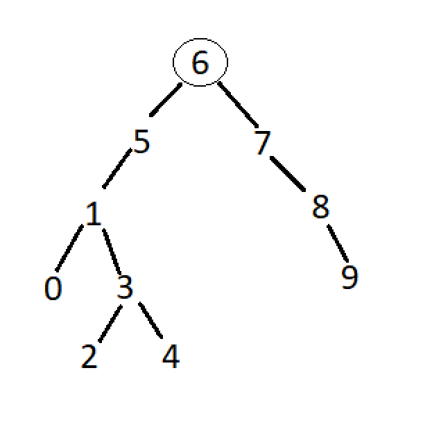

# Binary Search Tree

[7,5,1,8,3,6,0,9,4,2] Dizisinin Binary Search Tree aşamaları:
1. Öncelikle bir root belirliyoruz
root = 6
2. Eğer gelen sayı root'dan büyük ise sağına yeni bir dal olarak eklenir.Küçük ise soluna.

3. Bu işlem diğer sayılar içinde tekrarlanır.

 